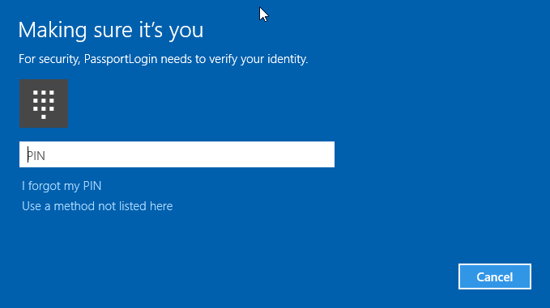
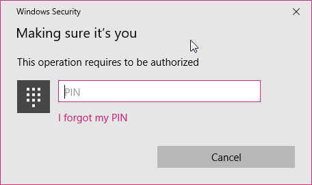

# Windows Hello

## What is Windows Hello?

Windows Hello is Microsoft's biometric sign-in system. It's built into Windows 10 and provides **a convenient way to authenticate users**. 

The Windows Hello authenticator is known as a **Hello**. A Hello is unique to the combination of an individual device and a specific user. A core benefit is that it's not shared in any way other devices, a with a server or the consuming app, cannot easily be extracted from a device. If multiple users share a device, each user needs to set up his or her own account. Every account gets a unique Hello for that device. 

You can think of a Hello as **a token you can use to unlock (or release) a stored credential**. The Hello itself does not authenticate you to an app or service, but it releases credentials that can. In other words, the Hello is not a user credential but it is a second factor for the authenticating process.

To use Windows Hello, users must have an account either in an **Azure Active Directory** or a **Microsoft Account** connected to their Windows machine.

## Authentication with Windows Hello

Windows Hello provides trustful way for a device to recognize an individual user. After the device has recognized the user based on either a biometric gesture or a PIN, it still has to authenticate to check whether the user has access to the resource.

Conceptually, you can consider that Windows Hello is a replacement for smart cards, with all their advantages, but with any of their disadvantages.

### How it works

Basically, when the user configured Windows Hello on Windows, a pair of public and private keys are generated and the private key is saved to a Trusted Platform Mobile (TPM). This is a specific hardware part of the machine able to store data (usually keys) in a secure way. If the machine doesn't have this it, then Windows Hello will use software encryption to protect it.

#### How keys are protected

Whenever it's possible, specially designed hardware modules are used to protect the keys, but this isn't a requirement. At stated before, Windows Hello used software-based methods to store them.

#### Authentication stage

Every time the user wants to access to a protected subject, Windows Hello will ask the user to enter a PIN or a biometric gesture. This is commonly known as "releasing the key".

However, keys aren't shared with the application. Instead, the application makes requests to the Windows Hello API to perform tasks like signing data,  for example, in order to perform requests to a service. In other words, an application never has access to the key, but it will ask Hello to perform the specific actions to perform and the results of those actions are retrieved.

## Use cases

The are different use cases to cover: 

 - **Application login**. One of the most common is to implement a **logging process into your application**. In this case, you won't use a username and password but Windows Hello.
 - **Authetication against Services**. Other common case is when your application wants to **authenticate against a service**.

## Implementing Windows Hello

The following section will help you implement Windows Hello in an application that doesn't have a login mechanism.

### Enrolling new users

Let's assume that we are creating a new app from scratch which will use Windows Hello. 

In first place, we need to check whether the user has enabled Windows Hello for his or her account. In case it's not configured, it prompts the user to enable it.

The check can be done using this code:

```csharp
var keyCredentialAvailable = await KeyCredentialManager.IsSupportedAsync();
if (!keyCredentialAvailable)
{
   // The user hasn't configured Windows Hello yet
   return;
}
```

The next step would be to ask the user for some information to sign up into your application. You could ask for the e-mail address, for instance. 

If the user has configured Windows Hello, the app should create the user's KeyCredential.

It can be done using this code:

```csharp
var keyCreationResult = await KeyCredentialManager
    .RequestCreateAsync("SampleAccount" , KeyCredentialCreationOption.ReplaceExisting);
```

After this code is execute, the user will be presented with a dialog like this:



The key also gets the optional key attestation information to acquire cryptographic proof that the key is generated on the TPM (Trusted Platform Module). The generated key, and optionally the attestation should be sent to the back-end server to register the device. This key pair is unique.

After the key pair and attestation information are created on the device, the public key, the optional attestation information, and the unique identifier (such as the email address) need to be sent to the backend registration service and stored in the backend.


Depending on your needs, you could collecto more information in the the registration process, but in this sample scenario we'll include only the e-mail.

Let's resume just after we left. We are obtaining the `keyCreationResult` from `KeyCredentialManager.RequestCreateAsync`. This code covers the different scenarios.

```csharp
var keyCreationResult = await KeyCredentialManager.RequestCreateAsync(AccountId, KeyCredentialCreationOption.ReplaceExisting);
    if (keyCreationResult.Status == KeyCredentialStatus.Success)
    {
        var userKey = keyCreationResult.Credential;
        var publicKey = userKey.RetrievePublicKey();
        var keyAttestationResult = await userKey.GetAttestationAsync();
        IBuffer keyAttestation = null;
        IBuffer certificateChain = null;
        bool keyAttestationIncluded = false;
        bool keyAttestationCanBeRetrievedLater = false;

        keyAttestationResult = await userKey.GetAttestationAsync();
        KeyCredentialAttestationStatus keyAttestationRetryType = 0;

        if (keyAttestationResult.Status == KeyCredentialAttestationStatus.Success)
        {
            keyAttestationIncluded = true;
            keyAttestation = keyAttestationResult.AttestationBuffer;
            certificateChain = keyAttestationResult.CertificateChainBuffer;
        }
        else if (keyAttestationResult.Status == KeyCredentialAttestationStatus.TemporaryFailure)
        {
            keyAttestationRetryType = KeyCredentialAttestationStatus.TemporaryFailure;
            keyAttestationCanBeRetrievedLater = true;
        }
        else if (keyAttestationResult.Status == KeyCredentialAttestationStatus.NotSupported)
        {
            keyAttestationRetryType = KeyCredentialAttestationStatus.NotSupported;
            keyAttestationCanBeRetrievedLater = true;
        }
    }
    else if (keyCreationResult.Status == KeyCredentialStatus.UserCanceled ||
        keyCreationResult.Status == KeyCredentialStatus.UserPrefersPassword)
    {
        // Show error message to the user to get confirmation that user
        // does not want to enroll.
    }
```

#### Attestation

TPM key attestation is a protocol that ensure that the key has been generated and bound to a TPM chip.

When a new key pair is created we have the option to retrieve attestation information generated by the TPM chip. You could send this as part of the sign-up process.

When it receives the generated RSA key, the attestation statement, and the AIK certificate, the server verifies the following conditions:
- The AIK certificate signature is valid.
- The AIK certificate chains up to a trusted root.
- The AIK certificate and its chain is enabled for EKU OID "2.23.133.8.3" (friendly name is "Attestation Identity Key Certificate").
- The AIK certificate is time valid.
- All issuing CA certificates in the chain are time-valid and not revoked.
- The attestation statement is formed correctly.
- The signature on KeyAttestation blob uses an AIK public key.
- The public key included in the KeyAttestation blob matches the public RSA key that client sent alongside the attestation statement.

Depending on which checks are met, you would implement different levels of authorization. 

### Logging on with Windows Hello

Once the user is enrolled into your system, it usually means he or she can use your application, but of course, depending on your scenario, you might want to perform an extra authentication before performing sensible operations, like making a payment, or accessing user profile information.

### Forced sign-in

In case you want to force the authentication, to ensure the person that is currently using the application is the one he or she says you can force the user to sign again using the UserConsentVerifier class.

This code will show a Dialog that will ask the user to enter their credentials:

```csharp
UserConsentVerificationResult consentResult = await UserConsentVerifier.RequestVerificationAsync("This operation requires to be authorized");
if (consentResult.Equals(UserConsentVerificationResult.Verified))
{
    // continue
}
```



Notice that you can set a message inform the user about the operation, since it's always a good practice to justify when they have to re-enter login information.

### Authentication at the backend side

The flow of the authentication from the back-end is usually the following:

1. The client calls the service to get a **challenge**, that you can see as a special kind token. This challenge is usually a **randomly generated stream of bytes**. To help you to generate this challenge there are special random number generators like the `RNGCryptoServiceProvider`. In this case, invoking `RNGCryptoServiceProvider.GetBytes(buffer)` will fill the buffer with random bytes.
2. Once the challenge is generated, it's returned to the user. At this step, the service should store the information about the challenge (**the user** that has been challenged and the **challenge token** itself), in order to be able verify the client's answer to the challenge in the next steps.
3. The user receives the challenge and **signs it with its private key**. **This part is where the Windows Hello API comes in**. The client will use the `KeyCredential.RequestSignAsync` that signs it, and the client returns the signed challenge to the service. This means that the client will call the service and will pass the signed challenge. 
4. The service receives the signed challenge from the client. Then, the service will have to look for the stored challenge for the specific user. Using the following data: 
	- **public key** of the user
    - the **signed challenge** (given by the client) 
    - the **original challenge** (the one the service generated in step 1)

    the service will be able to check if both the signed challenge and the orginal challenge match. If they match, the service can be sure that **the user is authorized**.

### Enrolling multiple devices

The code to register a new device is exactly the same as registering the user for the first time (from within the app).

```csharp
var keyCreationResult = await KeyCredentialManager.RequestCreateAsync(
    AccountId, KeyCredentialCreationOption.ReplaceExisting);
```

To make it easier for the user to recognize which devices are registered, you can choose to send the device name or another identifier as part of the registration. This is also useful, for example, if you want to implement a service on your backend where users can unregister devices when a device is lost.

### Using multiple accounts
It's common to support more than account within the same app. For example, you could link 2 Twitter accounts. The process very similar to what we did before. With Windows Hello, you can create multiple key pairs and support multiple accounts inside your app.
One way of doing this is keeping the username or unique identifier described in the previous chapter in isolated storage. Therefore, every time you create a new account, you store the account ID in isolated storage.
In the application, you only have to let the user choose among the existing accounts (and give the option to create a new one). The flow of creating a new account is the same as described before. Once the user selects an account, use the `AccountId` to log on the user in your application with this code:

```csharp
    var openKeyResult = await KeyCredentialManager.OpenAsync(AccountId);
```

This way, all the accounts (that belong to a single user) will be protected under the same PIN or biometric gesture.
